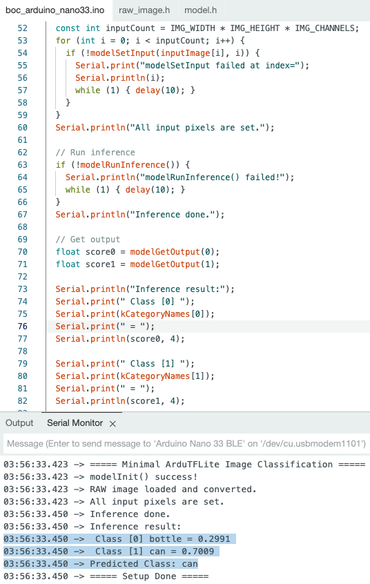
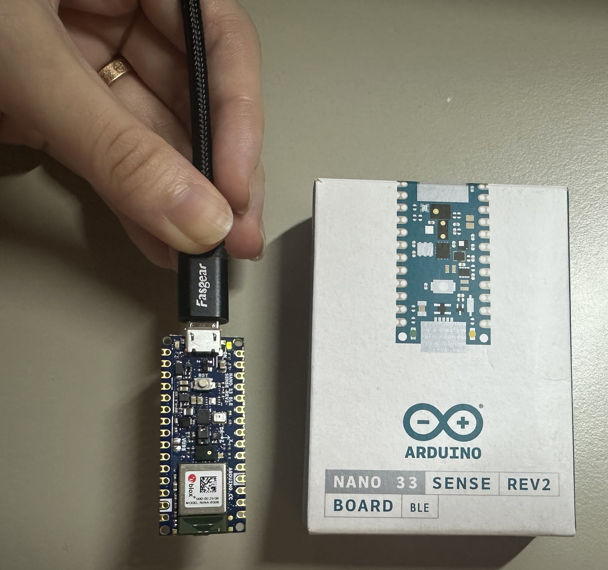

# ARDUINO-ODML

This project is designed to identify bottle or can on ARDUINO NANO 33 BLE. 
1) Trained a convolutional neural network (CNN) with 720 images with PyTorch.
2) Converted the trained PyTorch model to ONNX → TensorFlow → TFLite (.tflite)

    
3) Converted TFLite Model to C Array ```xxd -i bottle_can_simple_cnn_mps.tflite > model.h```
4) Installed [ArduTFLite](https://github.com/spaziochirale/ArduTFLite/tree/main) Library on Arduino IDE: Go to Sketch > Include Library > Manage Libraries → Search for "ArduTFLite"
5) Converted input jpeg file to raw_image.h using image_to_raw.py
6) Implemanted Arduino code (boc_arduino_nano33.ino) to load the model and run inference with the input image.
7) Uploaded it to Arduino and check Serial Monitor for the result (bottle/can).

## Output on Serial Monitor

```
03:56:33.423 -> ===== Minimal ArduTFLite Image Classification =====
03:56:33.423 -> modelInit() success!
03:56:33.423 -> RAW image loaded and converted.
03:56:33.423 -> All input pixels are set.
03:56:33.450 -> Inference done.
03:56:33.450 -> Inference result:
03:56:33.450 ->  Class [0] bottle = 0.2991
03:56:33.450 ->  Class [1] can = 0.7009
03:56:33.450 -> Predicted Class: can
03:56:33.450 -> ===== Setup Done =====
```




## ARDUINO NANO 33 BLE

[Webpage](https://store-usa.arduino.cc/products/nano-33-ble-sense-rev2?srsltid=AfmBOoojSEc04yoXGi8lmVvoNi9X3mDboBhs3DKiyOX_N4vi_nZkX5Ox)



## TODO

Connect to a camera (Arducam Mini) to Arduino nano 33 BLE to implement real-time inference.

## iOS Preview
Additionally, I converted the trained PyTorch model to CoreML and deployed to SwiftUI app for test.
<div class="image-container" style="display: flex; align-items: flex-start; gap: 20px;">
    
</div>