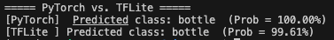

# ARDUINO-ODML (WIP)

The project is designed to identify bottle or can on ARDUINO NANO 33. 
1) Trained a convolutional neural network (CNN) with 720 images with PyTorch.
2) Converted the trained PyTorch model to ONNX → TensorFlow → TFLite (.tflite) with quantization.
    
3) Convert TFLite Model to C Array ```xxd -i bottle_can_simple_cnn_mps.tflite > model.h```
4) Install Arduino_TensorFlowLite Library: Open the Arduino IDE → Go to Sketch > Include Library > Manage Libraries → Search for "Arduino_TensorFlowLite"
5) Include model.h in Arduino Sketch

Also, converted the trained PyTorch model to CoreML and deployed to SwiftUI app for test.

## iOS Preview
<div class="image-container" style="display: flex; align-items: flex-start; gap: 20px;">
    
</div>